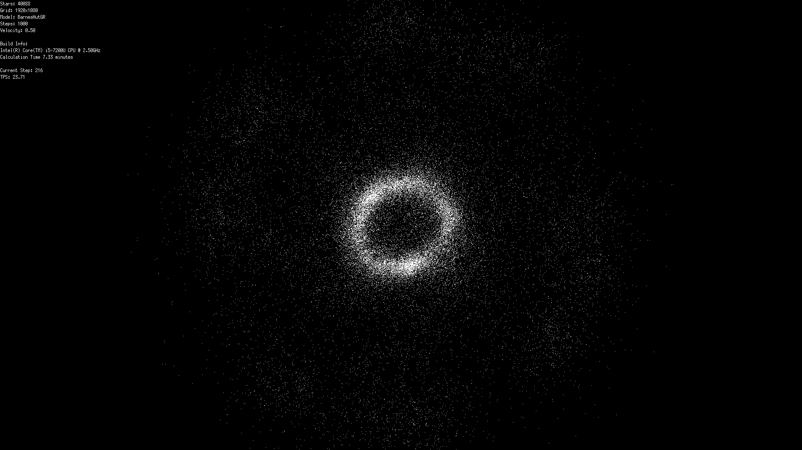
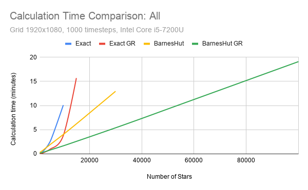

# go-star-sim
Star system simulation in Go

Comparing different calculation methods with and without goroutines.



## Dependencies

Ubuntu:
```
sudo apt install golang-go xserver-xorg-dev xorg-dev
```

## Build

```
go install ./cmd/star-calc/
go install ./cmd/star-sim/
```
or
```
go build ./cmd/star-calc/
go build ./cmd/star-sim/
```

## Run

Example:
```
./star-calc -stars 1000 -steps 500 -file /tmp/simdata
./star-sim -file /tmp/simdata
./star-calc -model BarnesHutGR -stars 1000 -steps 500 -file /tmp/simdata2
./star-sim -file /tmp/simdata2
```

## Measurement


